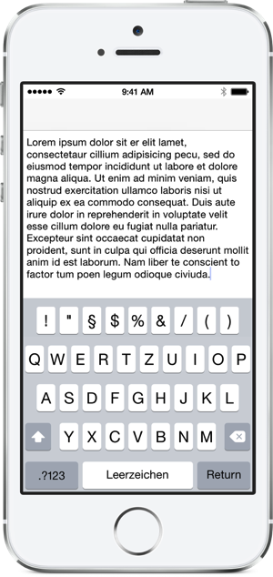

# BBInputBar

BBInputBar is a custom control to extend the iOS keyboard. It mimics the look and feel of the default (light) keyboard and can be configured to display icons or text. The buttons are positioned in the center with automatically calculated widths.

## Usage
Since there is no way to extend the keyboard via Interface Builder, BBInputBar must be created and configured via code. Fortunately this is pretty staightforward:

	self.buttonTitles = @[@"Q", @"W", @"E", @"R", @"T", @"Z", @"U", @"I", @"O"];
	BBInputBar *inputBar = [[BBInputBar alloc] initWithTitles:self.buttonTitles];
	inputBar.delegate = self;
	self.textView.inputAccessoryView = inputBar;

You can receive button-press-events via the `BBInputBarDelegate`-protocol, which consists of two methods.

	- (void)inputBar:(BBInputBar*)inputBar didPressButtonAtIndex:(NSInteger)index;

Gets called every time one of the buttons is pressed. It gives the index of the button, as well as the instance of the input bar.

	- (CGFloat)inputBar:(BBInputBar*)inputBar widthForButtonAtIndex:(NSInteger)index;

With this method you can customize the button width of every button. The buttons will still be centered, but the calculation now respects the custom button sizes.

